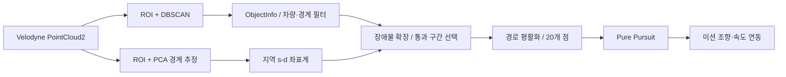

# Katri-2025 — 대학생 창작 모빌리티 경진대회

2025 대학생 창작 모빌리티 경진대회를 위해 사용한 **Team STIER의 ROS1 자율주행 소스 워크스페이스**입니다. Velodyne LiDAR 인지, GNSS·IMU 위치 추정, 미션 판단, 경로 추종과 차량 통신 코드를 포함합니다.

## 나의 역할

- **소속/역할:** Team STIER 판단팀 팀원, 정적장애물 회피 담당
- **담당 내용:** Velodyne VLP-16 3D LiDAR를 이용한 정적장애물 회피 방식 연구와 실차 적용 검토
- **다룬 기능:** ROI·PCA·DBSCAN 기반 장애물 및 주행 경계 인지, 지역 경로 생성, Pure Pursuit 제어 연계
- **사용 기술:** ROS1 Noetic, Python, C++, PCL, RViz

이 저장소는 팀 전체 워크스페이스입니다. 아래 설명은 제공된 `src_251031-1725.zip`의 코드 분석을 바탕으로 정리했으며, 모든 패키지를 개인 구현으로 표시하지 않습니다. 파일별 작성자, 최종 실차 실행 조합과 정량 성능은 이 스냅샷만으로 확정하지 않았습니다.

## 워크스페이스 구성

| 경로 | 주요 내용 |
| --- | --- |
| `src/mission` | 정적·동적 장애물 회피, 차선 주행, 배달, 주차, 유턴 등 미션 |
| `src/lidar/lidar/object_detector` | PCL ROI 필터, KD-tree 기반 DBSCAN, 장애물 중심·크기 메시지 |
| `src/lidar/lidar/lidar` | LiDAR 지역 경로용 Pure Pursuit와 RViz 설정 |
| `src/lidar/lidar/velodyne` | Velodyne 드라이버·포인트클라우드 처리 |
| `src/control/stier` | RDDF 경로, 구간 판단, 경로 추종·조향·속도 연동 |
| `src/control` | ERP42 메시지·통신, u-blox, 위치 추정·센서 융합 등 |
| `src/recognition`, `src/ocr_package` | 카메라 차선·신호등·정지선·문자 인식 관련 코드 |
| `src/Xsens_MTi_ROS_Driver_and_Ntrip_Client`, `src/ntrip_client-ros` | IMU 드라이버와 GNSS 보정 데이터 수신 |
| `src/its_bridge` | ITS 메시지 처리와 ASN.1 관련 코드 |

소스는 C++·Python을 함께 사용하며, 원본 `src/CMakeLists.txt`가 `/opt/ros/noetic`을 가리켜 **ROS Noetic 기반 환경의 흔적**을 확인할 수 있습니다. ERP42 연동 코드가 포함되어 있지만 실제 대회 차량 모델을 코드 포함 여부만으로 단정하지 않습니다.

## 정적장애물 회피

### 1. LiDAR 경계 추정과 지역 경로 생성

핵심 파일: [avoid_static_offset.py](src/mission/src/avoid_static_offset.py)

1. `/velodyne_points`에서 높이·XY 범위·각도 ROI를 적용하고, PCA로 기준 직선을 추정합니다. 기준선에 오프셋을 주어 좌우 주행 경계를 구성합니다. 카메라로 양쪽 차선을 직접 검출하는 방식과는 구분됩니다.
2. `/object_info`의 중심·크기로 장애물 바운딩 박스를 구성하고, 차량 자체 영역 및 주행 경계 밖 후보를 거릅니다.
3. 오른쪽 경계를 기준으로 종방향 `s`, 횡방향 `d`의 지역 좌표계를 구성합니다. 차량 반길이·반폭과 여유 거리를 고려해 장애물 금지 영역을 확장합니다.
4. 종방향 샘플마다 주행 가능 횡방향 구간에서 장애물 금지 구간을 빼고, 이전 선택 구간·좌우 회피 모드·최소 통로 폭을 이용해 경로를 선택합니다.
5. 모드 유지, 횡이동 변화 제한, 이동평균, 20개 점 재샘플링 및 점별 2D 등속도 Kalman 필터로 경로 변화를 완화합니다.
6. `/local_path`를 Pure Pursuit에 전달하고, 회피 시 `/lidarDeg`를 `/missionDeg`로 전달하며 `/missionKPH`를 발행합니다. 장애물이 없으면 차선 제어 모드로 전환합니다.

실제 활성 조건은 **`/section == 9`**입니다. 일부 주석의 구간 명칭·번호와 실행 조건이 일치하지 않아 여기서는 코드 조건을 기준으로 설명합니다.



### 2. 두 RDDF 경로 기반 대형 장애물 회피

핵심 파일: [avoid_static_large.py](src/mission/src/avoid_static_large.py)

- `/utm` 위치와 `/ublox_position_receiver/navpvt` 헤딩을 받아 두 RDDF 경로를 차량 상대 좌표로 변환합니다. 헤딩에는 각도 래핑을 포함한 Kalman 필터를 적용합니다.
- 전방 `x = 0.2~6.0m` 장애물 중심과 각 경로 점의 최소 거리가 `0.9m` 미만이면 해당 차선 점유 플래그를 설정합니다.
- 현재 차선과 좌우 측방 ROI 점유 상태를 함께 검사해 `/target_lane`을 선택합니다. `/section == 12`일 때 10Hz 루프에서 목표 차선을 발행합니다.
- [pp_lidar_vision.cpp](src/control/stier/src/pp_lidar_vision.cpp)에 `/target_lane` 구독 및 `/current_lane` 발행 코드가 있어 차선 전환 연동 구조를 확인할 수 있습니다.

이 방식은 임의의 새 경로를 탐색하는 방식이 아니라 **기록된 두 경로 중 목표 차선을 고르는 방식**입니다. 해당 파일의 전방 비상정지 ROI 및 ESTOP 발행 부분은 주석 처리되어 있습니다.

### 주요 인터페이스

| 토픽 | 메시지 | 역할 |
| --- | --- | --- |
| `/velodyne_points` | `sensor_msgs/PointCloud2` | LiDAR 입력 |
| `/object_info` | `object_detector/ObjectInfo` | 장애물 중심·크기·개수 |
| `/section` | `std_msgs/Int32` | 미션 활성 구간 |
| `/lanes_markers` | `visualization_msgs/MarkerArray` | 추정 주행 경계 |
| `/local_path` | `mission/PathInfo` | `cnt`, `x[20]`, `y[20]` 지역 경로 |
| `/lidarDeg` | `std_msgs/Float32` | Pure Pursuit 조향 출력 |
| `/missionDeg`, `/missionKPH` | `std_msgs/Float32` | 미션 조향·속도 명령 |
| `/static_force_lane` | `std_msgs/Int32` | 장애물 있음 0, 없음 1 |
| `/target_lane`, `/current_lane` | `std_msgs/Int32` | 목표·현재 차선 |

### 튜닝값 예시

아래는 `avoid_static_offset.py`의 기본값이며 성능 보장값이 아닙니다.

| 설정 | 기본값 | 의미 |
| --- | --- | --- |
| `lookahead_s`, `sample_ds` | 3.0m, 0.25m | 경로 생성 전방 범위·간격 |
| `veh_length`, `veh_width` | 2.020m, 1.160m | 장애물 확장에 쓰는 차량 크기 |
| `x_clearance`, `y_clearance` | 각 0.15m | 추가 여유 거리 |
| `min_corridor_width` | 0.50m | 후보 통로 최소 폭 |
| `dd_step_limit` | 0.12m | 인접 샘플의 횡방향 변화 제한 |
| `cluster_clear_timeout` | 1.5초 | 오래된 장애물 박스 제거 기준 |
| `avoid_speed_kph` | 4km/h | 회피 모드 속도 명령 |
| `CENTER_RIGHT_OFFSET_D` | 0.8m | 장애물 영향이 없는 샘플의 오른쪽 편향 상수 |

검출기의 `mainCallback`은 **ROI → DBSCAN**을 실행합니다. VoxelGrid 함수는 있으나 해당 호출은 주석 처리되어 있어 현재 처리 단계로 기재하지 않습니다. 지면 평면 분리도 이 실행 경로에서 확인되지 않습니다.

## 환경 복원 및 실행 참고

이 저장소는 기존 개발 환경의 소스 스냅샷입니다. Windows에서 정적 분석했으며 ROS 빌드·센서 재생·실차 주행은 실행하지 않았습니다. 아래는 Linux ROS Noetic 환경에서 복원하기 위한 시작 절차이며, 전체 워크스페이스의 빌드 성공을 보장하는 설치 스크립트는 아닙니다.

```bash
git lfs install
git clone https://github.com/suhyeon01004-hongik/Katri-2025.git ~/katri_ws
cd ~/katri_ws
git lfs pull
source /opt/ros/noetic/setup.bash

# ZIP에 담긴 머신 종속 catkin 링크를 현재 환경에서 재생성
rm src/CMakeLists.txt
catkin_init_workspace src

# rosdep 초기화가 완료된 환경에서 실행
rosdep install --from-paths src --ignore-src -r -y
catkin_make
source devel/setup.bash
```

기본 의존성은 ROS1, catkin, PCL, NumPy와 각 `package.xml`에 기록되어 있습니다. 카메라 파이프라인은 별도 딥러닝·CUDA 환경과 확장 모듈 빌드가 필요합니다. NTRIP 설정은 실행 전 로컬 환경변수 `NTRIP_USERNAME`, `NTRIP_PASSWORD`에 지정합니다.

메시지 생성과 패키지 빌드가 끝난 뒤, 별도 터미널마다 환경을 source하여 지역 경로 관련 노드를 실행할 수 있습니다.

```bash
roscore
rosrun object_detector object_detector
rosrun mission avoid_static_offset.py
rosrun lidar pure_pursuit_lidar.py
```

위 네 명령은 각각 별도 터미널에서 실행합니다. LiDAR 드라이버 또는 기록 데이터의 `/velodyne_points` 입력과 `/section` 발행자가 필요합니다. 차량 통신·차선 제어까지 시작하는 전체 주행 명령은 아니며, 구간 9의 입력 및 RViz에서 `/lanes_markers`, `/cluster_bboxes`, `/path_markers`, `/inflated_obstacles`를 먼저 확인합니다. `PathInfo`에는 헤더가 없고 해당 노드는 `velodyne` 좌표계를 전제로 합니다.

## 확인된 복원 과제와 한계

- 여러 launch·스크립트가 `/home/stier/catkin_ws` 절대 경로를 사용합니다. `avoid_static_large.py`는 `paths/lane1111.txt`, `lane2222.txt`를 읽지만 이 ZIP의 대응 파일은 `paths/~1031/`에 있습니다. 실행 전 경로·사용 코스를 맞춰야 합니다.
- `mission/launch/avoid_small.launch`와 일부 `final.launch`는 구형 스크립트명이나 현재 위치와 다른 경로를 참조합니다. 파일명이 `final`이라는 이유로 최종 대회 실행 구성을 의미하지 않습니다.
- `avoid_static_offset.py`의 구간 9와 제어기 변형들의 미션 번호를 맞춰야 합니다. `old/` 및 여러 제어기 변형은 비교 자료로 보존했습니다.
- 경로 생성기가 유효 통로를 찾지 못했을 때 이전 횡좌표를 유지하는 분기가 있습니다. 평활화·Kalman 필터 이후 전체 경로의 충돌 재검사도 확인되지 않으므로 충돌 회피 보장이나 완전한 정지 전략으로 해석하지 않습니다.
- 대회 순위, 완주 여부, 장애물 회피 성공률과 지연시간은 별도 시험 자료가 필요합니다.

## 원본 보존과 업로드 범위

- 입력: `src_251031-1725.zip`. 원본 ZIP은 로컬에 그대로 유지합니다.
- 소스·설정·경로·기존 문서 및 서드파티 라이선스를 보존합니다. 중첩 `.git`, 빌드·캐시·컴파일 산출물과 중복 ZIP은 제외합니다.
- `src/recognition/src/lane/69.pth`는 Git LFS로 관리합니다. Linux·Python 버전에 종속된 `.so` 확장 모듈은 해당 환경에서 다시 빌드해야 합니다.
- NTRIP 계정 기본값 세 곳을 환경변수 참조로 치환했습니다. 주행 알고리즘의 기능 수정은 하지 않았습니다.
- 팀 코드와 외부 패키지가 함께 포함되어 있습니다. 각 패키지의 `LICENSE`·`COPYING`·`package.xml`을 확인하며, 전체를 단일 신규 라이선스로 재정의하지 않습니다.

상세 업로드·검증 기록은 [docs/IMPORT_REPORT.md](docs/IMPORT_REPORT.md)를 참고하세요.
